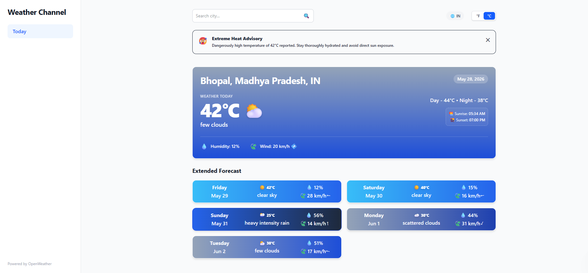

# 🌦️ Weather Channel Dashboard

A modern, highly responsive weather forecasting web application featuring real-time data visualization, dynamic contextual theme shifts, and smart search capabilities[cite: 1, 2]. Built entirely with semantic HTML5, Tailwind CSS, and vanilla JavaScript, it provides a seamless user experience across mobile, tablet, and desktop devices[cite: 1].



---

## 🚀 Key Features

### 📍 Intelligent Location & Search Engine
* **Automated Geolocation Tracking:** Automatically asks for user coordinates on launch, parsing them via the browser's Geolocation API[cite: 2].
* **Reverse Geocoding Resolution:** Automatically translates raw latitude and longitude into regional parameters (City, State, and Country names)[cite: 2].
* **Smart History Dropdown Menu:** Features an autocomplete menu that remains hidden for new users, instantly popping up once a search history is built. It stores up to 5 unique recent cities and features a quick **"Use Current Location"** route back to local metrics.
* **Smart Search Normalization:** Includes an internal dictionary mapping Indian states straight to their respective capitals[cite: 2]. It also hooks into the RestCountries API to resolve country queries to their capital cities[cite: 2].

### 🎨 Context-Aware Visuals & Dynamic Themes
* **Adaptive Gradient Backgrounds:** The main hero card and all extended 5-day forecast cards dynamically recalculate their gradient background variations and borders to reflect current weather criteria (e.g., matching clear skies, distinct cloud densities, heavy storms, mist, or snow)[cite: 1, 2].
* **Visual Weather Emojis:** Maps OpenWeather icon packages to vibrant, drop-shadowed emojis for intuitive scanning[cite: 2].

### 📊 Deep Meteorological Insights
* **Comprehensive Today Card:** Provides at-a-glance access to primary temperature, day/night splits, humidity percentage, and wind speeds[cite: 1, 2].
* **True-Heading Wind Indicator:** Dynamically rotates a vector direction arrow component using real-time meteorological degree metadata[cite: 2].
* **Timezone-Corrected Solar Intervals:** Renders calculated sunrise and sunset times specific to the searched city's native UTC offset[cite: 2].
* **5-Day Extended Forecast:** Slices 3-hour forecast chunks down to precise midday metrics, rendering a 5-day overview layout[cite: 1, 2].
* **Global Unit Toggle:** Effortlessly updates all active dashboard nodes simultaneously between Celsius (°C) and Fahrenheit (°F) states[cite: 1, 2].

---

## 🛠️ Tech Stack

* **Structure:** `index.html` (Semantic markup utilizing uniform layouts)[cite: 1]
* **Styling:** Tailwind CSS (Utility-first styling frame with precompiled classes)[cite: 1]
* **Logic:** `index.js` (Asynchronous native JavaScript, working entirely with the DOM without bulky framework overhead)[cite: 2]
* **External Integrations:** 
  * OpenWeatherMap API (Current Conditions & 5-Day / 3-Hour Forecast feeds)[cite: 1, 2]
  * RestCountries API (Country boundary-to-capital resolution)[cite: 2]

---

## 📂 File Architecture

```bash
├── index.html          # Core layout, sidebar routing context, and structural frames[cite: 1]
├── 5day.html           # Dedicated multi-day extended breakdown view (Route Placeholder)[cite: 1]
├── aqi.html            # Dedicated Air Quality Index panel (Route Placeholder)[cite: 1]
├── style.css           # Compiled Tailwind CSS output utility file[cite: 1]
├── index.js            # Unified async state engine and DOM rendering logic[cite: 2]
└── image_a186d9.png    # Interface screenshot asset

## ⚡ Quick Start & Setup

To run this application locally, you do not need to configure complex dev servers.

1. **Clone the repository:**
   ```bash
   git clone https://github.com/Shivank-Arya/project---weather-forecast-app.git
   cd project---weather-forecast-app
   ```

2. **Configure your API Key:**
   Open `index.js` and update the global constant with your personal credential:
   ```javascript
   const API_KEY = 'your_openweather_api_key_here';
   ```

3. **Launch the app:**
   Simply double-click or open `index.html` directly in any modern browser to view the functional interface[cite: 1]!

---

## 🔮 Roadmap / Future Enhancements
* Incorporate logic mapping for the **5 Day** and **Air Quality Index** standalone navigational routes[cite: 1].
* Configure a localized caching policy for the forecast payloads to respect external API call volume limits.